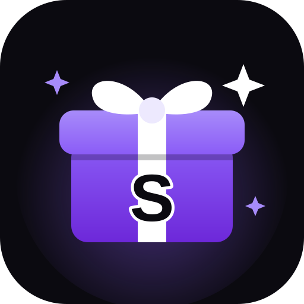

<p align="center"></p>

# Svag Gifts — казино на звёздах для Telegram

Бот и мини-приложение: **слоты, краш, мины, кости, кейсы, PvP-рулетка и PvP-хоккей**.
Баланс пополняется **Telegram Stars** или **чеками**, которые выдаёт админ. **Вывод — подарками Telegram** после подтверждения админом. Всё настраивается с телефона.

> **Про закон.** С выводом это уже азартная игра на деньги: подарки можно обменять на звёзды, а звёзды — продать. В РФ и во многих странах такое без лицензии запрещено, правила Telegram тоже ограничивают азартные игры. Решение о запуске и ответственность за него — на владельце.

---

## Шаг 1. Создать бота (@BotFather)

1. Откройте [@BotFather](https://t.me/BotFather) и отправьте `/newbot`.
2. Введите имя и username бота, username должен заканчиваться на `bot`.
3. Скопируйте **токен** вида `123456789:AAH...`. Это `BOT_TOKEN`, никому его не показывайте.

Для оплаты звёздами подключать платёжного провайдера не нужно: Stars работают сразу.

Аватарка для бота: отправьте @BotFather `/setuserpic`, выберите бота и пришлите картинку [`webapp/avatar.png`](webapp/avatar.png).

## Шаг 2. ID админа

Админ — **@wodoias** (ID `5349009098`), он уже вшит в код, ничего делать не нужно.
Добавить админов можно в `app/config.py`: строка `DEFAULT_ADMIN_IDS`, ID через запятую, например `"5349009098,123456789"`. ID человека можно узнать у [@userinfobot](https://t.me/userinfobot).

## Шаг 3а. Временно: запуск на GitHub Actions (без Railway)

Бот может работать прямо на серверах GitHub:
* Мини-приложение получает публичный адрес через бесплатный туннель Cloudflare.
* База сохраняется в ветку `data` каждую минуту и восстанавливается при перезапуске.
* Раз в 5 ч 40 мин бот перезапускается, это около минуты простоя. Следующий запуск ставится в очередь автоматически, если бот проработал хотя бы 2 минуты без сбоев.

1. На github.com откройте репозиторий → **Settings** → **Secrets and variables** → **Actions** → **New repository secret**.
2. **Name**: `BOT_TOKEN`, **Secret**: токен от @BotFather → **Add secret**.
3. **Actions** → **host** → **Run workflow**. Через минуту бот ответит на `/start`.

Ограничения временного варианта:
* **Бесплатные минуты.** Для приватного репозитория на бесплатном тарифе GitHub даёт 2000 минут Actions в месяц. Это примерно 33 часа работы бота, дальше Actions остановятся до следующего месяца. У публичных репозиториев минуты не ограничены.
* **Адрес мини-приложения** меняется при каждом перезапуске. Кнопка меню обновляется сама, а кнопки «Играть» в старых сообщениях перестают работать, так что нажмите `/start` заново.
* **Правила GitHub.** Держать постоянно работающий сервис на Actions GitHub не разрешает, поэтому это только временное решение до переезда на Railway.
* **Остановить бота:** **Actions** → **host** → **⋯** → **Disable workflow**, затем отмените текущий и ожидающий запуски (**Cancel run**).

## Шаг 3б. Постоянно: запустить на Railway

Если бот работал на GitHub Actions, перед запуском на Railway остановите workflow **host**, иначе две копии будут мешать друг другу. Перенести накопленную базу можно из ветки `data` (файл `bot.db`) на диск Railway.

1. Откройте [railway.com](https://railway.com) в браузере телефона → **Login with GitHub**.
2. **New Project** → **Deploy from GitHub repo** → репозиторий **bot**.
   Если его нет в списке, нажмите **Configure GitHub App** и дайте доступ.
3. Откройте сервис → **Variables** → добавьте **одну** переменную: `BOT_TOKEN` со значением токена от @BotFather.

   Остальное уже вшито в код (`app/config.py`):
   * админ `5349009098` (@wodoias);
   * база `/data/bot.db`;
   * ставки от 1 до 10 000 ⭐;
   * без стартового бонуса.

   Чтобы что-то поменять, либо отредактируйте `app/config.py`, либо добавьте одноимённую переменную (`ADMIN_IDS`, `MIN_BET`, `MAX_BET`, `START_BONUS`, `DB_PATH`). Переменная важнее значения из кода.

4. **Диск для базы**, чтобы балансы не пропадали при перезапуске: в проекте **+ Create** (или **New**) → **Volume** → выберите сервис → **Mount path** `/data`.
5. **Публичный адрес для мини-приложения**: сервис → **Settings** → **Networking** → **Generate Domain**. Если Railway спросит порт, укажите `8080`.
   Бот сам возьмёт этот адрес из переменной `RAILWAY_PUBLIC_DOMAIN`. Вписывать `WEBAPP_URL` не нужно.
6. В **Settings** → **Source** выберите ветку **main**.
7. Дождитесь статуса **Active** во вкладке **Deployments**. Логи: **Deployments** → последний деплой → **View Logs**.

Каждый коммит в `main` Railway разворачивает автоматически.

## Шаг 4. Проверить

1. Откройте своего бота и нажмите **Запустить** (`/start`). Появятся кнопка **🎰 Играть** и кнопка меню **🎰 Казино** слева от поля ввода.
2. Админу после `/start` станут доступны админские команды. Их можно посмотреть командой `/admin`.

---

## Чеки на звёзды (для админа)

| Команда | Что делает |
|---|---|
| `/check 100` | Чек на 100 ⭐, одна активация |
| `/check 50 10` | Чек на 50 ⭐, 10 активаций (каждый человек — один раз) |
| `/checks` | Список активных чеков и сколько активаций осталось |
| `/revoke код` | Отозвать чек |
| `/stats` | Игроки, пополнения, ставки, доход казино, выдано по чекам |
| `/user @username` | Баланс и статистика игрока |

После `/check` бот присылает ссылку вида `https://t.me/ваш_бот?start=c_…` и кнопку **📤 Поделиться**. Игрок открывает ссылку, и звёзды сразу зачисляются. Код чека также можно ввести в мини-приложении на главной, в поле **«Активировать чек»**.

## Вывод звёзд (подарками Telegram)

1. **Игрок** в мини-приложении нажимает на баланс → **Вывести** и выбирает подарок. Его стоимость сразу списывается с баланса.
2. **Админу** приходит заявка с кнопками **✅ Отправить** и **❌ Отклонить**. Там же видно, сколько игрок пополнил, поставил и выиграл.
3. **Отправить**: подарок дарит **аккаунт-релейер со своего баланса звёзд** (через MTProto). Держите на релейере звёзды, их баланс покажет `/stars`. Если звёзд не хватает, заявка остаётся ждать, и её можно отправить позже или отклонить.
   * Если у игрока нет @username, бот попросит его написать релейеру любое сообщение. Подарок уйдёт сам, повторно нажимать «Отправить» не нужно.
   * Звёзды, которые приходят от пополнений, копятся на боте. Переводить их на релейер нужно вручную: в Telegram бот не может передать звёзды аккаунту.
4. **Отклонить**: звёзды возвращаются игроку.

Правила вывода:
* Звёзды из чеков и стартового бонуса сначала нужно **отыграть**: сумма ставок должна быть не меньше полученного бесплатно. Иначе чек превращался бы в настоящие звёзды без игры.
* У игрока может быть только одна заявка на вывод одновременно.
* Подарок можно оставить или обменять на звёзды в профиле. За обмен Telegram начисляет чуть меньше стоимости подарка.

Команды админа: `/withdrawals` — заявки, ожидающие решения; `/stars` — звёзды релейера и бота; `/relayer`, `/nfts`, `/nftoff`, `/nfton`, `/nftsend` — NFT-кейс.

## Команды игроков

`/start` — открыть казино · `/deposit 100` — пополнить на 100 ⭐ · `/balance` — баланс · `/ref` — реферальная ссылка · `/help` — правила · `/paysupport` — вопросы по оплате.
Пополнить баланс можно и из мини-приложения: нажмите на баланс вверху.

Внизу мини-приложения есть меню из четырёх страниц:
* **Главная** — популярные игры и активация чека.
* **Игры** — все режимы.
* **Друзья** — реферальная программа.
* **Профиль** — баланс, статистика, лучший выигрыш, история, «Мои подарки».

## Реферальная программа

У каждого игрока есть ссылка вида `t.me/бот?start=r_ID`: на странице «Друзья» или по команде `/ref`.
* Кто запустил бота по ссылке, становится рефералом.
* **Пригласивший получает 10% от каждой покупки звёзд рефералом** — навсегда. Бот сразу присылает уведомление.
* Реферальный бонус нужно один раз отыграть ставками, как звёзды из чеков. Это защищает от «кэшбэка» через свой второй аккаунт.
* Привязать можно только нового игрока: в первые сутки, до первой покупки и один раз. Себя и «по кругу» пригласить нельзя.
* Процент задаётся константой `REFERRAL_RATE` в `app/db.py`.

## Игры и их математика

Всё случайное генерируется на сервере криптостойким генератором (`secrets`). Мини-приложение только показывает анимацию, поэтому подменить результат из браузера нельзя. Иксы — как на крупных площадках:

| Игра | Правила | Макс. икс | RTP |
|---|---|---|---|
| 🎰 Слоты | Как 🎰 в Telegram: 3 барабана (BAR, 🍇, 🍋, 7), 64 равновероятных исхода. **7️⃣7️⃣7️⃣ — NFT стоимостью ≈ ×40 от ставки** (модель у релейера с рыночной ценой в пределах ±25% от 40 ставок; если такой нет — ×40 звёздами), три одинаковых ×2, две семёрки ×1 (возврат), остальное ×0. В чате: `/slot 10` — бот кидает настоящий 🎰, исход решает Telegram | NFT ×40 | 85.9% |
| 🚀 Краш | Общие раунды: 7 с приём ставок, затем ракета летит для всех; видно ставки, выводы и аватарки других игроков; есть автовывод. P(дойдёт до ×x) = 0.95 / x | ×10 000 | 95% |
| 💣 Мины | Поле 5×5, от 3 до 24 мин, забрать можно в любой момент | ×1000+ | 90% |
| 🔻 Plinko | 8, 12 или 16 рядов, риск низкий, средний или высокий; шарик падает через штырьки в лунку с множителем | ×949 | ≈93% |
| 🎁 Кейсы | Настоящие подарки Telegram по их реальной цене (берётся из Telegram в момент игры): «Мишка» 25 ★, «Ракета» 50 ★; NFT-кейс 250 ★ с NFT админа | NFT | ~87% |
| ⚔️ PvP-рулетка | Общий банк, шанс пропорционален ставке, раунд 30 с после второго игрока, комиссия 5%; в ленте — аватарки игроков | — | 95% |
| ⬆️ Апгрейд NFT | Ставка — свои NFT, цель — NFT казино подороже; шанс = ставка / цена цели × 0.9 (до 75%); стрелка на круге | ×100+ | 90% |
| 🏒 PvP-хоккей | Поле делится на зоны пропорционально ставкам; шайба вылетает из центра в случайную сторону с сильным ударом и отскакивает от бортов; чья зона, где она остановилась, — тот забирает банк (комиссия 5%) | — | 95% |

Во всех играх, кроме PvP, выигрыши редкие. Всё это честная математика: множители и шансы, которые видит игрок, соответствуют реальным. Комиссия в костях и краше — константа `HOUSE_EDGE` (5%), в минах — `MINES_EDGE` (10%), обе в `app/games/logic.py`.

Выигрыш от ×10 показывается на весь экран с конфетти. На главной бежит лента крупных выигрышей всех игроков (от ×5).

Если игрок закрыл приложение посреди игры в краш, игра рассчитается сама, автовывод тоже сработает. Одиночная ставка в PvP возвращается через 10 минут, если никто не присоединился.

## Кейсы и NFT

Кейсы можно открывать **по 1–5 штук сразу** (кнопки ×1…×5): каждая рулетка крутится отдельно, всё списывается и зачисляется одной операцией.

**Обычные кейсы** состоят из настоящих подарков Telegram: 🧸💝 15 ★, 🌹🎁 25 ★, 🎂💐🚀🍾 50 ★, 🏆💍💎 100 ★.
* Цена каждого подарка берётся из Telegram (`getAvailableGifts`) в момент игры.
* Выигранный подарок зачисляется на баланс по своей реальной цене, его можно вывести.
* Если подарок пропал из каталога или подорожал так, что кейс стал выгоден игрокам сильнее 92%, кейс сам выключается.

**NFT-кейс** даёт шанс выиграть NFT-подарок. Призы в нём — **модели**, например «Plush Pepe · модель Frog Prince», а не конкретные номера.
* На сервере хранятся только модели: сколько подарков каждой модели есть у релейера и какая у неё рыночная цена.
* **Цена модели — реальная**: флор на маркетплейсе **MRKT** (@mrkt), то есть самый дешёвый лот этой коллекции **и модели**. В MRKT бот входит от имени релейера. Цены на MRKT в TON, в звёзды они переводятся по курсу: `/tonrate 200` задаёт курс вручную (звёзд за 1 TON), `/tonrate auto` берёт цену TON в $ из канала @tonprices (запасной источник — CoinGecko) и делит на цену звезды $0.015. Флор обновляется раз в 10 минут.
* Модель без свежей цены (старше часа), без лотов на маркете или без свободных подарков у релейера в кейс не попадает.
* Шансы считаются автоматически так, чтобы кейс в среднем возвращал 87%: чем дороже модель, тем реже она выпадает.
* **Выигравшему релейер передаёт случайный подарок выигранной модели** со своего аккаунта. Подарок сразу резервируется, поэтому одну и ту же вещь двум игрокам не пообещать.

**Релейер** — аккаунт казино, на котором лежат NFT-подарки. Бот работает от его имени через MTProto: узнаёт цены моделей на маркете и сам передаёт выигранные NFT. Бизнес-подключение не нужно: Telegram сейчас не даёт бизнес-ботам, подключённым к аккаунту владельца, управлять подарками. Настройка (все шаги подсказывает команда `/relayer`):
1. Получите `api_id` и `api_hash` на [my.telegram.org](https://my.telegram.org) → API development tools (можно с телефона).
2. В боте выполните по шагам:
   * `/relayer_api api_id api_hash`;
   * `/relayer_phone +7…`;
   * `/relayer_code 1 2 3 4 5` — код **с пробелами**, слитный Telegram блокирует;
   * `/relayer_password …` — если на аккаунте облачный пароль.

   Сообщения с ключом, кодом и паролем бот сразу удаляет. Сессия хранится в базе в зашифрованном виде: ключ выводится из токена бота.
3. `/nfts` покажет модели у релейера: запас, свободный остаток и пол маркета.
4. Если передача NFT платная, релейер оплачивает её звёздами со своего баланса — держите на нём немного звёзд.
5. Игроку с @username NFT приходит сразу. Игрок без @username получит от бота просьбу написать релейеру любое сообщение, и подарок уйдёт сразу после этого.

Выключить или включить модель: `/nftoff номер`, `/nfton номер`. Повторить неудавшуюся передачу: `/nftsend номер_выигрыша` (бот сам пришлёт этот номер). Выйти из аккаунта релейера: `/relayer_logout`.

## Ставки подарками

Игрок может играть своими подарками: достаточно **отправить подарок в Telegram аккаунту-релейеру**. В мини-приложении это раздел «Кошелёк → Подарки», там есть кнопка «Отправить подарок».
* **NFT** появляется в «Моих подарках» через несколько секунд. Он оценивается по полу маркета своей модели, так же как призы NFT-кейса. С ним можно:
  * **поставить в PvP-рулетку или хоккей** кнопкой 🎁 рядом со ставкой. Подарок идёт в банк по своей цене, и шанс считается с его учётом. Победитель забирает все подарки из банка к себе в «Мои подарки», а звёзды получает за вычетом комиссии;
  * **продать казино** за 90% пола маркета. Звёзды можно ставить в любые игры, а подарок пополняет запас релейера для кейсов и 777;
  * **вывести обратно**: релейер передаст его игроку.
* **Обычный подарок** (не NFT) сразу зачисляется на баланс звёздами по курсу обмена Telegram, то есть сколько звёзд даёт его конвертация.
* NFT без свежей цены (моделей нет на маркете) поставить или продать нельзя, пока цена не появится. Вывести его можно всегда.
* Подарки игроков не считаются запасом казино: они не выпадают в кейсах, пока игрок их не продал.
* Подарки, которые прислали админы, — это пополнение запаса казино, а не депозит.
* Подарки, пришедшие релейеру до включения функции, не зачисляются никому.

## TON — вторая валюта

В мини-приложении вверху есть переключатель **★ / 💎**. У игрока два баланса: звёзды и TON. Во всех играх ставят в выбранной валюте. PvP-раунды на звёзды и на TON идут раздельно. Кейсы в TON стоят столько же, сколько в звёздах, пересчёт по курсу `/tonrate`. NFT ставятся только в звёздные PvP-раунды.

**Пополнение.** Кошелёк казино по умолчанию — `UQC5wHZ0nk0liC5PSb2H1qq1c33vQPSjsDMSnDzVm5XIwahb` (можно сменить командой `/tonwallet UQ…` или выключить: `/tonwallet off`). В разделе «Кошелёк → Пополнить» игрок видит адрес и свой комментарий вида `SG<ID>`. Кнопка «Открыть кошелёк» открывает Tonkeeper с уже заполненным переводом.
* Каждые 20 секунд бот читает входящие переводы через toncenter.com и зачисляет их по комментарию. Каждая транзакция зачисляется один раз. Переводы, пришедшие до подключения кошелька, не зачисляются.
* Чтобы поднять лимиты toncenter, можно добавить секрет `TONCENTER_KEY`.
* Пригласивший получает 10% и с пополнений в TON.

**Вывод.** Игрок указывает адрес и сумму: минимум 0.1 TON, сумма списывается сразу. Админу приходит заявка с адресом и ссылкой на готовый перевод. Админ переводит со своего кошелька и нажимает **«Отправил»**. «Отклонить» возвращает TON игроку.
* Ключи кошелька на сервере не хранятся, поэтому автоматической отправки нет.
* Реферальные TON-бонусы, как и звёздные, нужно один раз отыграть.

`/stats` показывает отдельный блок по TON, `/withdrawals` — заявки и на подарки, и на TON.

Цены NFT везде показаны и в звёздах, и в TON: «12 000 ★ · 60 TON».

## VIP-уровни, рейкбек, ежедневный бонус, лидеры

**VIP-уровни** зависят от суммы всех ставок. TON считаются как 100 ★ за 1 TON.

| Уровень | Нужно поставить | Рейкбек |
|---|---|---|
| 🥉 Новичок | 0 ★ | 0.2% |
| 🥈 Серебро | 2 000 ★ | 0.4% |
| 🥇 Золото | 10 000 ★ | 0.6% |
| 💠 Платина | 50 000 ★ | 0.8% |
| 💎 Бриллиант | 200 000 ★ | 1% |

**Рейкбек** — доля каждой ставки, которая копится и забирается в профиле. Отыгрывать его не нужно.
* Максимум 1% — это 1/5 самой маленькой комиссии казино (5% в PvP и краше), поэтому казино остаётся в плюсе в любой игре.
* Проценты задаются в `LEVELS` в `app/games/logic.py`.

**Ежедневный бонус** — раз в сутки от 1 до 100 ★, в среднем около 4.2 ★.
* Доступен только тем, кто хоть раз пополнял баланс, чтобы бонус не фармили с новых аккаунтов.
* Бонус нужно один раз отыграть.

**Лидеры недели** — топ игроков по сумме ставок за 7 дней, на главной странице.

## Новые кейсы и NFT в краше

**Кейсы из подарков:** «Сердечко» за 20 ★, «Мишка» за 25 ★, «Ракета» за 50 ★, «Праздник» за 60 ★, «Люкс» за 105 ★. Каждый в среднем возвращает 86–88% стоимости.

**NFT-кейсы:** 🍀 Starter за 50 ★, 🎲 Mini за 100 ★, 💎 NFT-кейс за 250 ★ (цена задаётся настройкой), 🏆 Gold за 500 ★, 👑 Premium за 1000 ★, 🐉 Legend за 2500 ★.
* Чем дороже кейс, тем большая доля его цены уходит на NFT: от 40% до 85%.
* В кейс попадают только NFT не дешевле половины его цены.
* Каждый кейс в среднем возвращает около 87%. Если при текущих ценах возврат падает ниже 80%, кейс скрывается.

**Демо-NFT (пока идёт разработка).** `/dupe 12` берёт с MRKT 12 настоящих моделей с картинками и флором.
* Их видят все игроки: в NFT-кейсах, на 777 и в апгрейде, с пометкой «демо».
* Самих подарков у релейера нет, поэтому игрок, выигравший демо-NFT, сразу получает его флор звёздами (или в TON по курсу). Игроки не проигрывают деньги за несуществующие подарки.
* Админу кладутся 3 дюпа в «Мои подарки». Их нельзя вывести, но можно продать казино и ставить в игры. Если такой дюп в PvP выигрывает игрок, он получает его стоимость звёздами.
* Цены демо-моделей обновляются с MRKT раз в 10 минут. Удалить все демо-NFT: `/dupe_clear`.

**Краш на NFT:** кнопка 🎁 рядом со ставкой, только в режиме ★. Поставленные NFT идут в ставку по флору. Если игрок успел вывести, NFT возвращаются, а прибыль сверх их стоимости приходит звёздами. Если ракета взорвалась, NFT забирает казино.

## Апгрейд NFT

Раздел «Игры → Апгрейд».
* Игрок выбирает **свои NFT** из «Моих подарков» — ставка принимается только NFT, звёздами нельзя.
* Цель — NFT-модель из запаса релейера, дороже ставки, со свежей ценой.
* Шанс = стоимость ставки / цена цели × 0.9. Максимум 75%, минимум 1%. Цены — пол маркета Telegram.
* Стрелка крутится по кругу: попала в фиолетовую дугу — выигрыш. Результат решает сервер.
* **Автоподбор цели:** кнопки ×1.5 / ×2 / ×5 / ×10 сами выбирают NFT с ценой ближе всего к «ставка × множитель». Цель пересчитывается, когда меняются выбранные NFT.
* На каждой цели показаны её множитель и шанс. Есть «Выбрать все» и поиск по коллекции или модели.
* **Выиграл** — релейер передаёт случайный подарок выбранной модели, как в NFT-кейсе.
* Поставленные NFT в любом случае забирает казино, они становятся запасом для кейсов и апгрейда.
* Комиссия: `UPGRADE_EDGE` (10%) в `app/games/logic.py`.

## Бренд

* Название: **Svag Gifts**. Логотип — [`webapp/logo.svg`](webapp/logo.svg): фиолетовая подарочная коробка с буквой S и белым бантом.
* Два цвета:
  * почти чёрный `#0B0A10` — фон, поверхности — его оттенки;
  * фиолетовый `#8B5CF6` — акцент, со светлыми оттенками `#A78BFA` и `#EDE9FE`;
  * текст белый, выигрыш подсвечивается фиолетовым, проигрыш — приглушённым серым.
* Шрифты: Unbounded для заголовков, Manrope для текста.

## Надёжность и безопасность

* Каждый запрос мини-приложения проверяется по подписи Telegram (`initData`), поэтому играть от чужого имени нельзя.
* Все операции с балансом выполняются в транзакциях и пишутся в журнал `ledger`. Баланс не может стать отрицательным.
* Повторная доставка платежа от Telegram не зачисляет звёзды дважды. Сумма и владелец счёта проверяются перед оплатой.
* Выдавать чеки могут только ID из `ADMIN_IDS`.
* Токен бота маскируется в логах.

## Если что-то не работает

* **Нет кнопки «Играть»** — не создан домен (шаг 3.5), в логах будет «WEBAPP_URL не задан».
* **Мини-приложение пишет «Сессия недействительна»** — закройте и откройте его заново из бота.
* **`/check` не отвечает** — проверьте, что ваш ID есть в `DEFAULT_ADMIN_IDS` в `app/config.py` (или в переменной `ADMIN_IDS`).
* **`Conflict: terminated by other getUpdates`** — запущены две копии бота с одним токеном.

## Для разработчика

```
app/
  main.py        запуск: бот (long polling) + веб-сервер в одном процессе
  config.py      переменные окружения
  db.py          SQLite: пользователи, журнал операций, платежи, чеки, игры
  casino.py      игровые операции, каждая — одна транзакция
  games/logic.py математика игр
  web.py         API мини-приложения (aiohttp) + статика
  bot.py         команды бота, оплата Stars, админка
webapp/          мини-приложение (HTML/CSS/JS без сборки)
tests/           pytest: математика, деньги, API, бот
```

Тесты: `pip install -r requirements-dev.txt && pytest -q`. Они также запускаются в GitHub Actions на каждый push.
